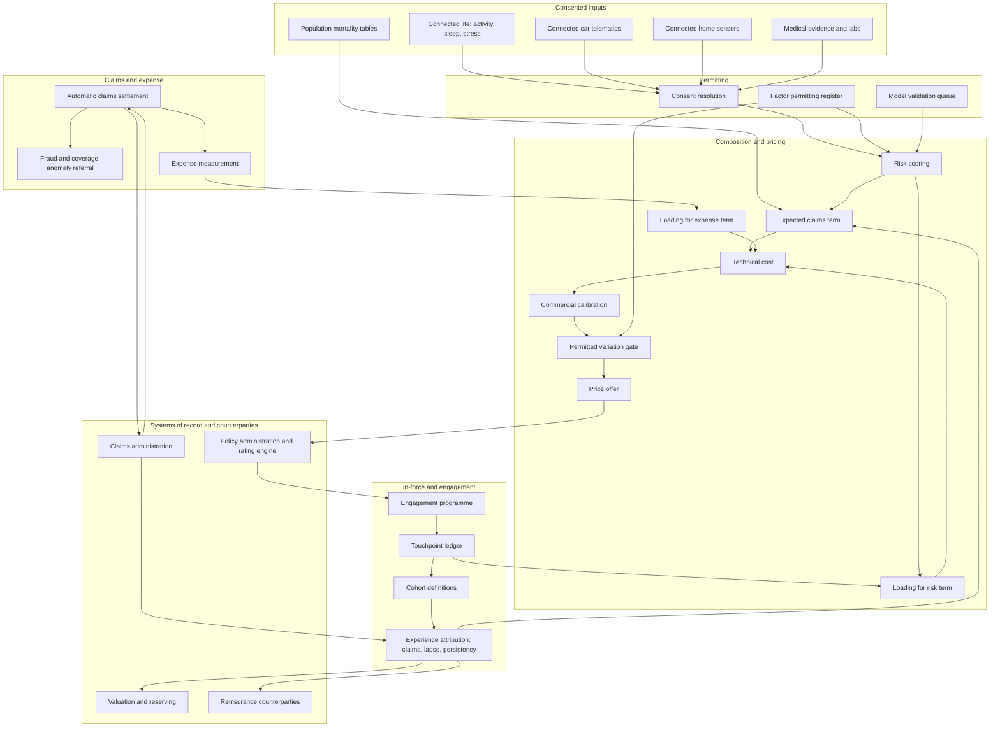

# Loadline

**Source:** `ai-in-insurance/h2o_ai-session2-h2oaiworldlondon2018-madsenv2-181102025107/`
**Domain:** `ai-ins`
**One-liner:** A premium-composition platform for life and health risk carriers in which every production model, engagement programme, and automation is bound to a named component of the price — expected claims, risk loading, or expense loading — and no component may move further than the rate structure filed in that jurisdiction permits.
**Wedge:** Individual life and health protection at a carrier or reinsurance vehicle underwriting mortality and morbidity, entering through all-cause mortality and lifestyle risk scoring on the in-force book, then extending to engagement-linked risk loading and automated claims.
**Positioning:** Applied machine learning organised around the premium formula rather than around the model. Underwriting platforms optimise placement speed and analytics vendors optimise predictive lift; Loadline makes each model defend a specific term of the price, proves the engagement effect against realised experience, and enforces the permitted range of variation per jurisdiction — which is the constraint that determines whether a better risk score can be turned into a better price at all.

## Market research synthesis

### Thesis from source

The source is a practitioner deck from the co-founder and chief executive of a reinsurance vehicle, presented at a machine-learning conference, and it contains one equation that reorganises the entire problem. Price equals expected claims plus loading for risk plus loading for expense. Each term has a distinct and stated lever. Expected claims can be lowered through active engagement. The loading for risk tends to be significantly higher for chronic conditions such as diabetes, and can be lowered by more frequent touchpoints — with the crucial qualification, stated explicitly, *as long as pricing can vary*. The loading for expense falls as automation rises. This decomposition is the deck's real contribution because it converts a vague claim that machine learning helps insurers into three separable business cases with different owners, different evidence requirements, and — in the case of the risk loading — a hard regulatory precondition that most analytics programmes discover only after the model works.

The context is an inflection driven by supply, not demand: sensor cost is falling while data availability rises, crossing into what the deck labels an inflection zone. It maps the resulting data estate across connected life (daily activity, diet, sleep, stress), connected car (driving style, speeding, braking, fuel savings, maintenance, emergency call), connected home (smoke alarm, water leaks, burglary), and connected finance (pension, investments, savings, payments), and observes that insurtech has emerged but remains relatively nascent when interest is compared with biotech and fintech. Its consequence for the business model is a stated shift in the role of insurance: from helping you when bad things happen, to helping you prevent bad things from happening, and when they do, helping you manage. Prevention is not framed as a marketing veneer; it is the mechanism by which the expected-claims term falls.

The deck then redraws the value chain. Today it runs pre-market — business and market intelligence, product development, pricing and reinsurance, sales and marketing — then post-market through underwriting, operations and servicing, claims, interaction and advice, with the process described as labour intensive and driving high fixed costs. The future state collapses to pre-market research and development plus five in-market capabilities: calibration, distribution, scoring, interaction and advice, and automatic claims, enabled by analytics and machine learning, distributed ledger and smart contracts, robo advice and tools, and environment creation, with the process fully automated and fixed costs significantly reduced. Each capability carries examples, and each example carries a regulatory shadow the deck acknowledges with the blanket caveat "subject to local rules and regulations." Calibration means calibrating pricing to better match commercial conditions — the deck's phrase is pricing "as opposed to costing" — with mortality by postal code as an example. Scoring means determining a risk score for given data and product elements, with driver analytics, health by wearable data including fitness and electrocardiogram, and health by new data including images, microbiome, diet, epigenetics, and genetics. Distribution means reaching customers cost-efficiently through alternative data, targeted advertising, and peer networks. Interaction and advice means determining the optimal insurance structure and finding proper conversational responses. Automatic claims means developing the ingredients to automate the claims process, plus fraud detection and coverage analytics.

The empirical demonstrations are modest in scale and precise in implication. An automated modelling run on a simple twelve-month S&P 500 return series with momentum and fundamental indicators produced what the author calls fascinating results in about an hour and fifteen minutes. More tellingly, the team reverse-engineered an existing all-cause mortality risk score: they fed an already-designed model's problem to automated machine learning and, in a little over an hour, it essentially picked the design of the model and produced results consistent with their own research. The lifestyle illustration quantifies the stakes on Dutch life expectancy — a 45-year-old's chance of reaching 65 shown at 73 percent, 92.5 percent, and 98 percent across lifestyle profiles. Read together, these say something specific: model construction is no longer the scarce resource, and the spread that behaviour creates in mortality is very large. What remains scarce is the ability to attach a model to a term of the price, prove the engagement effect against realised experience, and act on it inside what the local rate structure permits. That is the product.

### Buyer & economic model

- **Primary buyer:** Chief Underwriting Officer or Chief Pricing Actuary at a life and health carrier; at a reinsurance vehicle of the kind the source's author runs, the chief executive who owns the treaty result directly.
- **Users:** pricing and product actuaries (per rate revision), underwriters and medical underwriting referral teams (per case), the analytics and data science team (continuous), in-force management and engagement programme owners (weekly), claims assessors and fraud investigators (per claim), reinsurance managers monitoring treaty experience (quarterly), compliance and conduct officers plus the data protection officer (at each gate), distribution partners and their oversight function (per campaign).
- **Budget owner / value metric:** the underwriting result. The value metric is decomposed to match the source's equation: realised claims against expected claims for engaged versus unengaged cohorts, risk loading released per unit of touchpoint frequency actually permitted by the filed rate structure, and expense loading reduction from underwriting and claims automation. Persistency is tracked as a hard constraint, because engagement that lowers claims while raising lapse can destroy the value it creates.
- **Competing status quo:** a rating engine holding a filed table, a predictive model built in an analytics environment and handed over as a score, a wellness or engagement programme run by marketing with no experience feedback loop, a separate automated underwriting rules engine, and reinsurance experience studies produced annually in spreadsheets. The gap is that no one can state which term of the premium a given model or programme is moving, whether the movement is permitted in the jurisdiction, or whether the realised experience of the engaged cohort has validated the assumption it was priced on.

### Domain constraints

- **Regulatory / trust / safety:** the source's own caveat is the design constraint. Risk factors must be justifiable and cannot serve as proxies for protected characteristics, which puts the deck's own calibration example — mortality by postal code — directly in scope, since geography frequently proxies ethnicity and deprivation. Health data from new sources faces line-specific restrictions: genetic test results are restricted or prohibited in underwriting in many markets under moratoria or statute, and epigenetic and microbiome data sit in an unsettled space where a permitted-use position must be recorded before use rather than assumed. Rate structures are filed or otherwise constrained, so the frequency and magnitude of permitted variation is a legal fact, not a product choice — a monthly repricing capability is worthless where the filed structure allows annual revision. Prevention services must not cross into regulated medical advice, and incentives must not constitute prohibited inducements. Automated underwriting declinatures and claims decisions require an explainable basis and a route to human review.
- **Data sensitivity:** wearable, connected-car, and connected-home data is continuous personal data whose consent is revocable, purpose-limited, and often granted for a service rather than for pricing. Health and lifestyle inference is special-category data in most European jurisdictions and requires an explicit lawful basis. Because the risk-loading case depends on touchpoint frequency, the product's economics are directly exposed to consent withdrawal, which must therefore be modelled as a pricing risk rather than handled as an operational exception. Reinsurance data sharing needs a defined basis, since cession experience files contain individual mortality and morbidity outcomes.
- **Change-management realities:** the source itself notes insurtech is nascent, and life pricing bases change slowly because the liabilities are long. A carrier cannot reprice an in-force book to reflect a new engagement effect, so the first commercial application is new business plus voluntary in-force programmes. Medical underwriters and pricing actuaries will not accept a score whose factors they cannot inspect against the rating basis. Engagement effects are confounded by self-selection — healthy lives volunteer — so the platform must be able to separate selection from causation or the expected-claims saving will be booked and then lost. And the source's demonstration that automated modelling can reproduce a model design in about an hour means governance, not construction, becomes the bottleneck: the number of candidate models will outrun the capacity to validate and permit them.

## Business requirements

- BR-1: Every model in production must declare which term of the premium it acts on — expected claims, loading for risk, or loading for expense — and a model that cannot name its term may not be deployed.
- BR-2: Each rating factor and model feature must carry a recorded permitted-use position per jurisdiction covering discrimination and proxy risk, restrictions on genetic and other new health data, and explainability to the applicant, assessed before deployment rather than at rate filing.
- BR-3: The permitted range and frequency of price variation must be held per jurisdiction and product, and no repricing, discount, or loading adjustment may be issued outside it, so that the source's condition that pricing must be able to vary is enforced rather than assumed.
- BR-4: Any reduction in the risk loading justified by touchpoint frequency must be supported by evidence that the touchpoints occurred at the assumed frequency and that the rate structure permits variation at that frequency.
- BR-5: Engagement programmes must report realised claims experience for engaged and comparable unengaged cohorts, with a stated method for separating self-selection from behavioural effect, before any expected-claims saving is credited to pricing.
- BR-6: Persistency and lapse experience for engaged cohorts must be monitored alongside claims experience, and an engagement programme that improves claims while materially worsening persistency must be flagged as value-destroying.
- BR-7: The technical cost and the commercial price must be recorded separately for every quotation, and any deliberate calibration between them must be attributed to a named commercial decision, so that pricing remains distinguishable from costing.
- BR-8: Expense loading reductions claimed from underwriting or claims automation must be evidenced by measured cost per policy issued and per claim settled, not by projected straight-through rates.
- BR-9: Consent for each behavioural and health data source must be verifiable at the moment of use, and withdrawal of consent must trigger a defined pricing and servicing fallback rather than a service failure.
- BR-10: Automated declinatures, exclusions, and claims decisions must be explainable to the applicant or claimant in terms of the factors used, and must offer a route to human review.
- BR-11: Prevention and engagement services must remain within the boundary of insurance services, avoiding regulated medical advice and prohibited inducements, with that boundary reviewed per jurisdiction and per programme.
- BR-12: Reinsurance treaty experience must be reported against the pricing basis by cession and cohort, so that the ceding and assuming parties can see whether the assumptions the treaty was priced on are holding.
- BR-13: Every candidate model must pass validation and permitting before production regardless of how quickly it was produced, and the platform must report the queue of candidates awaiting validation as an operational risk.

## User stories

Canonical user stories live in sibling [USER_STORIES.md](USER_STORIES.md).

## System design

### Overview

Loadline organises everything around the premium composition. On the new-business path, an application or in-force record resolves its consent state per data source, then passes to scoring, where each active model contributes to exactly one declared term of the price: expected claims, loading for risk, or loading for expense. The composition engine assembles those contributions into a technical cost, records it, and then applies commercial calibration as a separate, attributed step — preserving the source's distinction between pricing and costing. Before any price leaves the system, the permitted-variation gate checks the proposed price against the jurisdiction's permitted range and revision frequency for that product; a price outside the envelope is refused rather than adjusted silently. On the in-force path, engagement programmes emit touchpoint events per member, which the experience engine joins to realised claims, lapse, and persistency outcomes for engaged and matched unengaged cohorts, producing the evidence that either sustains or withdraws the expected-claims and risk-loading assumptions. A third path handles automatic claims: cleared coverage and evidence patterns settle without human touch and emit their measured cost, which is what allows the expense-loading term to be evidenced rather than projected. Cutting across all three is the permitting layer — per-factor, per-jurisdiction positions on discrimination, restricted health data, explainability, and inducement boundaries — plus a validation queue that every candidate model must clear no matter how fast it was generated.

### Actors & boundaries

- **Actors:** applicant and policyholder, distribution partner, underwriter, medical referral assessor, pricing actuary, analytics lead, engagement programme owner, claims assessor, fraud investigator, reinsurance manager, compliance and conduct officer, data protection officer.
- **Trust boundary:** policy administration, the rating engine of record, and claims administration remain systems of record; Loadline owns the composition, the permitting positions, the variation envelope, the touchpoint record, and the experience attribution. Behavioural and health data is consumed as consented features, and raw device streams remain in their source boundary — what crosses is a feature with a consent reference and a permitted-use position. The permitted-variation gate is a hard boundary: no downstream system may accept a price the gate refused. Reinsurance counterparties receive cohort-level experience against the pricing basis, not raw individual records, unless a treaty data basis says otherwise.
- **Human-in-the-loop points:** granting and withdrawing a factor's permitted-use position per jurisdiction; model validation and permitting; underwriting referral and override; approval of commercial calibration beyond a threshold; approval of an engagement programme against the medical-advice and inducement boundaries; adjudication of an automated declinature challenged by an applicant; sign-off of an expected-claims saving before it is credited to pricing.

### Core capabilities

1. **Consent resolution** — verifies at point of use which behavioural and health sources may feed which decision, per jurisdiction and per purpose.
2. **Risk scoring** — model execution producing contributions attributable to exactly one declared premium term, with factor-level explanation.
3. **Premium composition** — assembles expected claims, risk loading, and expense loading into a recorded technical cost.
4. **Commercial calibration** — the attributed, approved step from technical cost to offered price, keeping pricing distinct from costing.
5. **Permitted-variation gate** — jurisdiction and product envelope for magnitude and frequency of price variation, refusing out-of-envelope prices.
6. **Factor permitting register** — per-factor, per-jurisdiction positions on proxy and discrimination risk, restricted health data, explainability, and permitted rating use.
7. **Model validation queue** — mandatory validation and permitting for every candidate model, with queue depth reported as operational risk.
8. **Engagement and touchpoint ledger** — programme enrolment, touchpoint events, measured frequency against assumed frequency, and consent state over time.
9. **Experience attribution** — realised claims, lapse, and persistency for engaged and matched unengaged cohorts, with selection-effect separation.
10. **Automatic claims settlement** — cleared coverage and evidence patterns settled without human touch, with fraud and coverage anomaly referral.
11. **Expense measurement** — measured cost per policy issued and per claim settled, feeding the expense-loading term.
12. **Reinsurance experience reporting** — cession and cohort experience against the treaty pricing basis.

### Conceptual data

- **Primary entities:** RiskSubject, Application, ConsentRecord, DataSource, Feature, FactorPermit, RiskModel, ModelValidation, ScoreContribution, PremiumComposition, TechnicalCost, CommercialCalibration, VariationEnvelope, PriceOffer, EngagementProgramme, Enrolment, TouchpointEvent, CohortDefinition, ExperienceObservation, ClaimEvent, AutomaticClaimRule, ExpenseMeasurement, CessionExperience, ReviewDecision.
- **Critical events:** consent granted, consent withdrawn, feature computed, score contributed, composition assembled, calibration approved, price offered or refused by the variation gate, policy issued, member enrolled, touchpoint recorded, cohort observation closed, claim notified, claim settled automatically or referred, fraud referral raised, expense measured, permitted-use position granted or withheld, model validated or rejected, cession experience published.
- **Retention / audit needs:** the composition, the factors used, their permits, and the variation envelope in force must be retained for the life of the contract plus the complaint and litigation window — for life and health policies that is decades, and it is the only defence against a discrimination or mis-pricing challenge years after issue. Touchpoint and consent histories retain for as long as they support a price, since a risk-loading reduction is only defensible while its touchpoint evidence exists. Experience observations and cohort definitions retain to support the reserving and treaty basis. Special-category health data follows the narrowest applicable retention with deletion on consent withdrawal, while the derived permitting decision is retained without the underlying data.

### Integrations (conceptual)

- **Systems of record:** policy administration and rating engine, claims administration, reinsurance administration and treaty terms, medical underwriting and evidence services, distribution and broker platforms, payments and premium collection, actuarial valuation and reserving.
- **Upstream signals:** connected life and wearable feeds including activity, sleep, and heart signals; connected car telematics; connected home sensors for water, smoke, and intrusion; medical evidence and laboratory results; population mortality and life-expectancy tables; consent and preference management; jurisdictional rating and conduct rule sources; fraud and identity services.
- **Downstream actions:** price offers and refusals to distribution and quotation channels, underwriting decisions and referrals, exclusions and loadings into policy issue, engagement enrolment and nudge delivery, automatic settlement instructions and fraud referrals, expense and experience feeds to actuarial reserving, cohort experience packs to reinsurance counterparties, and permitting evidence to compliance and to rate filings.

### High-level architecture

The scoring and composition path runs at quotation speed and is gated; the experience path runs on a cohort clock measured in quarters and is what makes the gate's assumptions honest. Keeping them separate matters because an engagement saving must never be credited to a price before the experience that justifies it has been observed.

### Success metrics

- **Leading:** share of production models with a declared premium term and a completed validation; factors in use with a current permitted-use position per jurisdiction, targeting full coverage; candidate models awaiting validation, tracked as a queue rather than a backlog, given the source's demonstration that a model design can be reproduced in about an hour; consent coverage per data source against the coverage assumed in pricing; measured touchpoint frequency against assumed frequency per engaged cohort; prices refused by the permitted-variation gate and the reason distribution; automatic settlement rate within cleared coverage patterns.
- **Lagging:** actual to expected claims ratio for engaged versus matched unengaged cohorts, with the selection effect separated; risk loading released per product and jurisdiction, and the share of that release supported by permitted variation frequency; expense loading reduction evidenced by measured cost per policy issued and per claim settled; persistency and lapse experience for engaged cohorts against the unengaged baseline; quote-to-bind conversion and mix shift after a repricing; treaty experience against pricing basis by cession and cohort; automated declinatures challenged and overturned on human review; conduct findings on rating factors or engagement incentives, targeting zero.

## OpenAPI skeleton

Canonical HTTP surface lives in sibling [openapi.yaml](openapi.yaml). Summary:

- **Base path:** `/v1/...`
- **Auth:** `X-API-Key` for quotation channels, device and evidence feeds, and claims administration; Bearer JWT for underwriters, actuaries, and compliance users, with permitting and calibration approval restricted by role.
- **Resource groups:** Scoring, Composition, Permitting, Engagement, Experience, Claims, Reinsurance.
