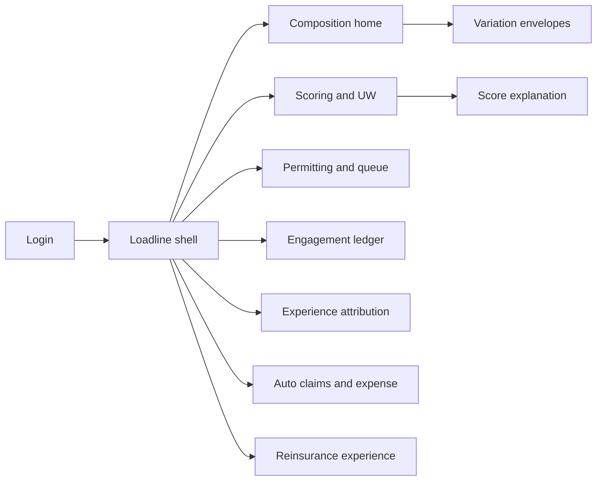
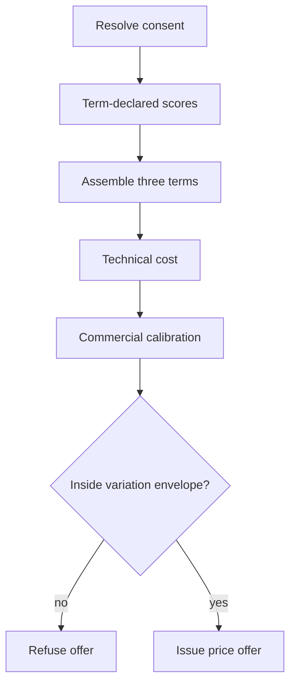

# Loadline — Web app

**Product:** [PRODUCT.md](./PRODUCT.md)
**Primary surface:** Premium-composition console (pricing actuaries + underwriters)
**Secondary surfaces:** Engagement experience desk; model validation queue; reinsurance cession packs (read-only export)
**Design thesis:** Loadline is a balance-scale for the premium equation — Price = expected claims + risk loading + expense loading — not a model zoo. Every production artefact hangs from exactly one named term of that equation, and the jurisdiction’s filed variation envelope is a hard stop, not a warning. Visual language is deep charcoal with three distinct term colours (claims cyan, risk amber, expense steel-blue) on a cool underwriting ground: out-of-envelope offers refuse in coral; credited engagement savings only mint after experience sign-off. The brand wordmark sits like a Plimsoll mark on every composition so operators never forget the load line that must not be submerged.

## UX research synthesis

### Category peers (best-in-class)

- **Earnix:** Rating tables, price optimisation, and technical-vs-commercial separation patterns. Steal: explicit technical cost vs offered price with attributed calibration; reject black-box “optimal price” without variation-envelope refusal.
- **Swiss Re Magnum / automated UW workbenches:** Factor-level explanations, referral, and human review on declinature. Steal: explainable score → accept/refer/override; reject speed-first UW that skips permitted-use checks on health data.
- **Discovery Vitality (engagement economics):** Touchpoints tied to pricing/benefits with experience feedback. Steal: measured frequency vs assumed frequency; reject wellness marketing chrome and unverified “savings” badges.
- **DataRobot / H2O MLOps queue patterns:** Fast model generation with mandatory validation gates. Steal: validation queue depth as operational risk (source: model redesign in ~1 hour); reject auto-promote-to-production.

### Patterns to adopt / reject

- **Adopt:** Declared premium term per model; three-term composition UI; permitted-variation gate that refuses; factor permitting per jurisdiction; engagement cohorts with selection separation; persistency beside claims; consent-at-use with fallback; validation queue before production; technical≠commercial; treaty experience vs pricing basis.
- **Reject:** Model lift as the hero KPI; silent out-of-envelope adjustment; postal-code factors without proxy review; genetic/restricted data in auto-score; crediting expected-claims savings before experience; chatbot medical advice.

### Trust, density, and workflow constraints from PRODUCT.md

“Subject to local rules” is the product (BR-2, BR-3). Genetic and new health data need pre-recorded permitted use (BR-2). Risk-loading cuts need real touchpoints at assumed frequency (BR-4). Engagement must not destroy value via lapse (BR-6). Prevention must not become medical advice (BR-11). Density is filing-grade on composition and permits; quotation path is fast but gated; experience desk is quarterly-cohort dense.

## Information architecture

### Nav model

### Roles → default home

| Role | Default home | Why |
|------|--------------|-----|
| Pricing actuary | Composition home + envelopes | Term ownership and permitted variation (BR-1, BR-3) |
| Underwriter / medical referral | Scoring workbench | Factor explain + restricted-data blocks (BR-2, BR-10) |
| Analytics lead | Validation queue | Construction speed ≠ permit speed (BR-13) |
| Engagement programme owner | Touchpoint ledger + experience | Frequency and value (BR-4–6) |
| Claims assessor | Auto claims / fraud referrals | Cleared patterns only (BR-8, BR-10) |
| Compliance / DPO | Factor permits | Withhold per market (BR-2, BR-11) |
| Reinsurance manager | Cession experience | Treaty vs pricing basis (BR-12) |

### Cross-links to OpenAPI resources

| Nav area | OpenAPI tags / resources |
|----------|---------------------------|
| Consent, scores, explanations | Scoring |
| Compositions, calibration, offers, envelopes | Composition |
| Factor permits, models, validation queue | Permitting |
| Programmes, touchpoints, frequency | Engagement |
| Cohorts, observations, savings credits | Experience |
| Automatic settlements, fraud, expense | Claims |
| Cession experience; human review decisions | Reinsurance / review |

## Screen inventory

### Composition home

- **Purpose:** See the book’s premium terms in motion — which models and programmes hang from expected claims, risk, and expense.
- **Entry:** Pricing actuary login.
- **Layout regions:** Brand + Plimsoll mark; three-term strip with linked models/programmes; technical vs commercial gap; envelope refusals this period; validation queue depth.
- **Primary actions:** Open composition; open envelope; open experience credits pending.
- **Empty / loading / error:** Model without declared term = cannot show in production strip (BR-1).
- **BR / story ties:** BR-1, BR-7; pricing actuary stories.

### Premium composition detail

- **Purpose:** Assemble expected claims + risk loading + expense loading → technical cost → attributed calibration → offer.
- **Entry:** Quotation deep link; home drill.
- **Layout regions:** Term panels with score contributions; technical cost; calibration with named decision; variation-envelope check; offer/refuse result.
- **Primary actions:** Approve calibration; issue offer; open factor permits used.
- **Empty / loading / error:** Out-of-envelope = coral refuse, no silent clip.
- **BR / story ties:** BR-3, BR-7.

### Variation envelopes

- **Purpose:** Hold jurisdiction × product magnitude and frequency limits; gate all offers.
- **Entry:** Pricing nav; compliance.
- **Layout regions:** Envelope table; revision calendar; refusal log reasons.
- **Primary actions:** Edit envelope (controlled); simulate proposed price.
- **Empty / loading / error:** Missing envelope = all offers blocked for that product/market.
- **BR / story ties:** BR-3; source “as long as pricing can vary.”

### Scoring workbench

- **Purpose:** Run term-declared scores with factor explanation; block restricted health data.
- **Entry:** Underwriter default; application link.
- **Layout regions:** Consent state per source; score contributions by term; factor list mapped to rating basis; accept/refer/override; declinature explanation + human review route.
- **Primary actions:** Accept; refer medical; override with reason; challenge auto-decline.
- **Empty / loading / error:** Negative/missing permit or consent → block feature, not soft warn.
- **BR / story ties:** BR-2, BR-9, BR-10.

### Factor permitting register

- **Purpose:** Per-factor, per-jurisdiction positions on proxy, genetics, explainability, rating use.
- **Entry:** Compliance home; blocked feature deep link.
- **Layout regions:** Factor × market matrix; evidence; withhold/grant; postal-code proxy review flags.
- **Primary actions:** Grant; withhold; require explainability pack.
- **Empty / loading / error:** Unpermitted factor in candidate model = validation fail.
- **BR / story ties:** BR-2; compliance stories.

### Model validation queue

- **Purpose:** Every candidate waits — fast AutoML does not skip permitting.
- **Entry:** Analytics lead home.
- **Layout regions:** Queue depth (ops risk KPI); declared premium term; permit status; validate/reject.
- **Primary actions:** Validate; reject; request more evidence.
- **Empty / loading / error:** Empty queue = healthy; growing depth = amber risk banner.
- **BR / story ties:** BR-13.

### Engagement programmes and touchpoint ledger

- **Purpose:** Enrolment, touchpoint events, measured vs assumed frequency for risk-loading case.
- **Entry:** Engagement owner home.
- **Layout regions:** Programme list; frequency meter; consent withdrawals; inducement/medical-advice boundary status.
- **Primary actions:** Open cohort; pause programme; trigger pricing fallback on consent withdraw.
- **Empty / loading / error:** Frequency below assumption = cannot support risk-loading cut (BR-4).
- **BR / story ties:** BR-4, BR-9, BR-11.

### Experience attribution

- **Purpose:** Engaged vs matched unengaged claims, lapse, persistency; selection vs behaviour; credit savings only after sign-off.
- **Entry:** Pricing + engagement; savings credit workflow.
- **Layout regions:** Cohort compare; selection-method statement; claims A/E; persistency flag; credit approval.
- **Primary actions:** Sign credit to pricing; withdraw credit; flag value-destroying (claims↓ lapse↑).
- **Empty / loading / error:** Insufficient observation = provisional, no mint credit.
- **BR / story ties:** BR-5, BR-6.

### Technical vs commercial calibration log

- **Purpose:** Keep pricing distinct from costing with named commercial decisions.
- **Entry:** Composition detail; audit.
- **Layout regions:** Technical cost; offered price; attribution; approver threshold.
- **Primary actions:** Approve above-threshold calibration; export filing note.
- **Empty / loading / error:** Unattributed gap = block offer.
- **BR / story ties:** BR-7.

### Automatic claims and expense

- **Purpose:** Settle cleared patterns; measure cost per claim/policy for expense-loading evidence.
- **Entry:** Claims nav.
- **Layout regions:** Cleared pattern list; settlements; fraud/coverage anomaly referrals; expense measurements.
- **Primary actions:** Refer; release pattern; export expense evidence.
- **Empty / loading / error:** Projected STP cannot feed expense term — measured only (BR-8).
- **BR / story ties:** BR-8, BR-10.

### Consent and fallback

- **Purpose:** Verify consent at use; withdrawal triggers defined pricing/servicing fallback.
- **Entry:** Scoring path; engagement member view.
- **Layout regions:** Source consents; purpose; withdrawal event; fallback price path.
- **Primary actions:** Apply fallback; notify member; freeze term that depended on source.
- **Empty / loading / error:** Use without consent = hard refuse.
- **BR / story ties:** BR-9.

### Reinsurance cession experience

- **Purpose:** Treaty experience by cession/cohort vs pricing basis.
- **Entry:** Reinsurance manager home.
- **Layout regions:** Cession table; A/E vs basis; pack export (cohort-level).
- **Primary actions:** Export counterparty pack; flag basis break.
- **Empty / loading / error:** Missing basis link = incomplete pack warning.
- **BR / story ties:** BR-12.

### Human review desk

- **Purpose:** Applicant/claimant challenges to automated declinatures and claims decisions.
- **Entry:** Review queue; decision deep link.
- **Layout regions:** Explanation factors; evidence; overturn/uphold; audit log.
- **Primary actions:** Overturn; uphold; feed model override reasons.
- **Empty / loading / error:** Empty = healthy automated quality message.
- **BR / story ties:** BR-10.

## Key flows

1. **Quote with composition** — resolve consent → score by term → compose technical cost → calibrate → variation gate → offer or refuse; failure: missing permit, consent, or envelope.

2. **Credit engagement saving** — measure touchpoints → close cohort observation → separate selection → check persistency → sign savings credit → only then move expected-claims term.

3. **Permit factor** — propose feature → jurisdiction review → grant/withhold → unblock validation.

4. **Validation before production** — candidate enters queue → validate → production only with declared term (BR-1, BR-13).

5. **Consent withdrawal fallback** — withdrawal event → freeze dependent features → apply fallback price/service path → keep cover.

## Design system

### Tokens (CSS variables)

- `--color-ink: #E8EDF2` — text on charcoal
- `--color-charcoal-950: #0B0E12` — app ground
- `--color-charcoal-900: #141A22` — panels
- `--color-charcoal-700: #2C3644` — rules
- `--color-claims: #3DB8C5` — expected claims term
- `--color-risk: #D4A017` — risk loading term
- `--color-expense: #5B7C99` — expense loading term
- `--color-mint: #2F9E7A` — experience-credited saving
- `--color-coral: #E2554A` — envelope refuse / permit withhold
- `--color-fog: #8B9AAB` — secondary labels
- `--color-brand: #A8B4C0` — Loadline / Plimsoll accent
- `--font-display: "Space Grotesk", sans-serif` — composition numerals and titles
- `--font-body: "IBM Plex Sans", sans-serif` — workbenches
- `--font-mono: "IBM Plex Mono", monospace` — model ids, permit ids
- `--space-1`…`--space-8`: 4px scale
- `--radius-sm: 3px`; `--radius-md: 6px`
- `--motion-compose: 200ms ease-out` — term panels settle into technical cost
- `--motion-refuse: 160ms ease-in` — coral envelope refusal
- `--motion-credit: 240ms ease-out` — mint savings credit stamp
- Atmosphere: charcoal hull with a faint horizontal Plimsoll/load-line motif; three-term colour only for premium math — no wellness lifestyle stock photos in console.

### Typography & brand

- Display for the three-term equation and offered price; mono for permits and model ids.
- Plimsoll wordmark on composition and offer screens; never replace with “AI Score.”
- Login: brand-first (“Price by the load line”); equation as the only supporting line; one CTA.

### Do / don’t

- **Do:** One term per model; refuse out-of-envelope; permit before score; credit after experience; show persistency with claims; separate technical and commercial.
- **Don’t:** Lift-only leaderboards; silent price clipping; unverified wellness savings; genetic auto-score; purple “smart pricing” glow.

### Accessibility & domain trust cues

- AA+ on claims/risk/expense colours vs charcoal; terms also labelled by name, not colour alone.
- Live regions for envelope refusals and consent withdrawals.
- Focus order: consent → permits → scores → composition → envelope → offer.
- Declinature explanations meet plain-language needs; review route always visible.

## Component patterns

- **ThreeTermStrip** — expected claims / risk / expense with linked artefacts.
- **CompositionBalance** — assemble terms into technical cost.
- **VariationEnvelopeGate** — magnitude/frequency check with hard refuse.
- **FactorPermitChip** — per-jurisdiction grant/withhold.
- **ScoreExplainPanel** — factors mapped to rating basis.
- **ValidationQueueMeter** — depth as operational risk.
- **TouchpointFrequencyMeter** — measured vs assumed.
- **CohortExperienceCompare** — engaged vs matched unengaged + selection method.
- **SavingsCreditStamp** — mint only after sign-off.
- **PersistencyWarning** — value-destroying engagement flag.
- **ConsentFallbackPath** — withdrawal → defined price/service path.
- **PlimsollMark** — brand load-line on money-bearing screens.

## Out of scope for v1 web

- Wearable device apps; full medical advice / telehealth; replacement rating engine of record; AutoML training notebooks; consumer wellness social feeds; native mobile underwriting; genetic counselling workflows.
